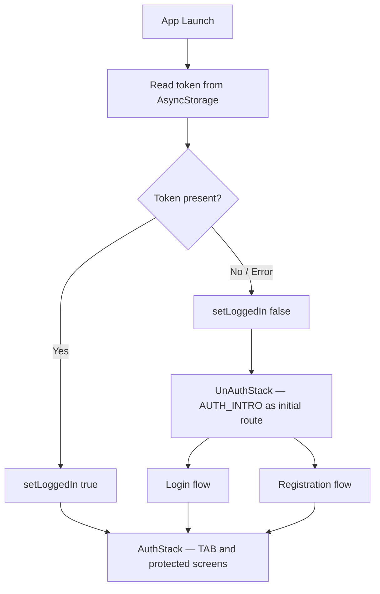

DOSS uses JWT-based authentication stored in device-local AsyncStorage. On every app launch, the app reads the stored token to determine whether to show the authenticated or unauthenticated experience — no network call is required for the initial check.

## Two entry paths

<CardGroup cols={2}>
  <Card title="Registration" icon="user-plus" href="/authentication/registration">
    New users verify their email, verify their phone number, and set a 4-digit PIN to create an account.
  </Card>
  <Card title="Login" icon="right-to-bracket" href="/authentication/login">
    Returning users enter their phone number and 4-digit PIN to authenticate.
  </Card>
</CardGroup>

## Auth state

Auth state is managed globally by a [Zustand](https://github.com/pmndrs/zustand) store defined in `src/store/StateManager/useAuthStore.js`.

```javascript useAuthStore.js
import {create} from 'zustand';

export const useAuthStore = create(set => ({
  loggedIn: false,
  setLoggedIn: loggedIn => set({loggedIn}),
  user: {},
  setUser: userInfo => set({user: userInfo}),
}));
```

| Field | Type | Description |
|---|---|---|
| `loggedIn` | `boolean` | Whether the current session is authenticated. Defaults to `false`. |
| `user` | `object` | The authenticated user object, populated after login or on profile fetch. |
| `setLoggedIn` | `function` | Sets the `loggedIn` flag. Called after a successful login, registration, or token check. |
| `setUser` | `function` | Stores the user profile object in state. |

## App boot sequence

The `Root` component (`src/navigation/Root/Root.jsx`) runs an async token check on mount:

```javascript Root.jsx
useEffect(() => {
  const init = async () => {
    try {
      const token = await storage.getData('token');
      setLoggedIn(!!token);
    } catch (e) {
      setLoggedIn(false);
    }
  };
  init();
}, [setLoggedIn]);
```

While the token is being read, a `<Loader />` is displayed. Once resolved, navigation proceeds.

## Navigation structure

All navigation is managed by a `MainStack` component that conditionally renders one of two stacks based on `loggedIn`:



### UnAuthStack screens

All screens in the unauthenticated stack start from `AUTH_INTRO`:

| Route constant | Screen | Purpose |
|---|---|---|
| `AUTH_INTRO` | `AuthIntro` | Entry point — choice between Login and Start KYC |
| `LOGIN` | `LoginInput` | Phone number input for login |
| `ENTER_PIN` | `EnterPin` | PIN entry to complete login |
| `EMAIL_INPUT` | `EmailInput` | Email address input for registration |
| `EMAIL_VERIFY` | `EmailVerify` | Email OTP verification |
| `EMAIL_VERIFY_SUCCESS` | `EmailVerifySuccess` | Email verified confirmation |
| `NUMBER_INPUT` | `NumberInput` | Phone number input for registration |
| `NUMBER_VERIFY` | `NumberVerify` | Phone OTP verification |
| `NUMBER_VERIFY_SUCCESS` | `NumberVerifySuccess` | Phone verified confirmation |
| `EMAIL_NUMBER_VERIFY_SUCCESS` | `EmailNumberVerifySuccess` | Both verified — proceed to PIN creation |
| `CREATE_PIN_INPUT` | `CreatePinInput` | Set new 4-digit PIN |
| `CONFIRM_PIN` | `ConfirmPin` | Confirm the new PIN |
| `CREATE_PIN_SUCCESS` | `CreatePinSuccess` | PIN created — sets `loggedIn: true` |
| `SIGN_UP_SUCCESS` | `SignUpSuccess` | Account creation complete |

### AuthStack screens (auth-related)

Once authenticated, PIN-related screens are accessible from the `AuthStack`:

| Route constant | Screen | Purpose |
|---|---|---|
| `RESET_PIN_INPUT` | `ResetPinInput` | Enter a new PIN during reset |
| `RESET_CONFIRM_PIN` | `ResetConfirmPin` | Confirm the new PIN during reset |
| `RESET_PIN_SUCCESS` | `ResetPinSuccess` | PIN reset complete |
| `PAY_ENTER_PIN` | `PayEnterPin` | PIN entry to approve/reject a payment request |
| `ENTER_GROUP_PIN` | `EnterGroupPin` | 6-digit code entry to join a group |

## Security model

<Note>
The JWT token is stored in AsyncStorage under the key `token`. It is set immediately after a successful login (`EnterPin`) or after PIN confirmation during registration (`ConfirmPin`).
</Note>

<Warning>
Token expiry is not handled with an automatic refresh flow. If an API call fails due to an expired token, the user must log in again. Logging out clears the token from AsyncStorage and sets `loggedIn` to `false`.
</Warning>

- **PIN requirement**: All payment actions require the user to re-enter their 4-digit PIN at the point of action. The PIN is never cached in memory after login.
- **FCM token**: A Firebase Cloud Messaging device token (`fcm_token`) is retrieved from AsyncStorage and sent with every login and PIN confirmation request to enable push notifications on the authenticated device.
- **Deep links**: The app handles `doss://` deep links. Notifications that open the app navigate to `doss://Notifications` via `Linking.openURL`.
